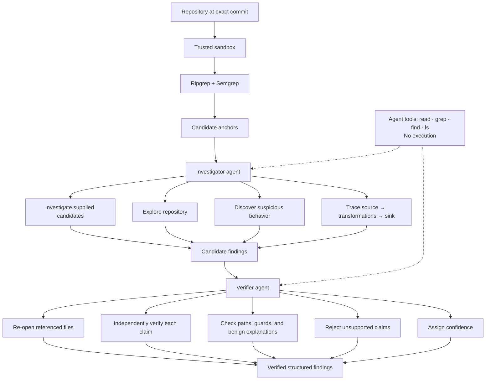

```mermaid
flowchart TD
  R[Repository at exact commit] --> S[Trusted sandbox]
  S --> D[Ripgrep + Semgrep]
  D --> C[Candidate anchors]

  C --> I[Investigator agent]
  I --> I1[Investigate supplied candidates]
  I --> I2[Explore repository]
  I --> I3[Discover suspicious behavior]
  I --> I4[Trace source → transformations → sink]
  I1 --> ID[Candidate findings]
  I2 --> ID
  I3 --> ID
  I4 --> ID

  ID --> V[Verifier agent]
  V --> V1[Re-open referenced files]
  V --> V2[Independently verify each claim]
  V --> V3[Check paths, guards, and benign explanations]
  V --> V4[Reject unsupported claims]
  V --> V5[Assign confidence]

  V1 --> F[Verified structured findings]
  V2 --> F
  V3 --> F
  V4 --> F
  V5 --> F

  T[Agent tools: read · grep · find · ls\nNo execution] -.-> I
  T -.-> V
```
